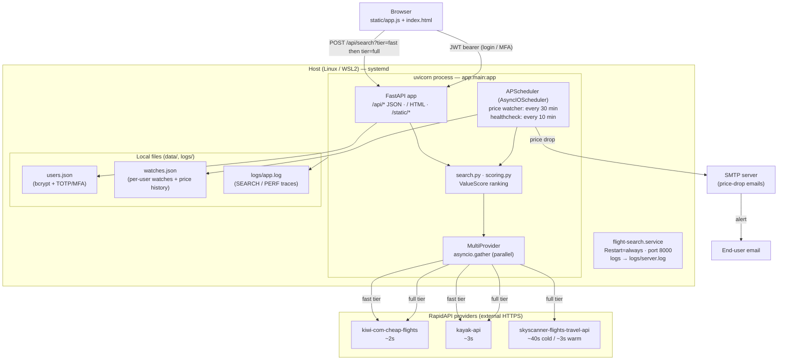
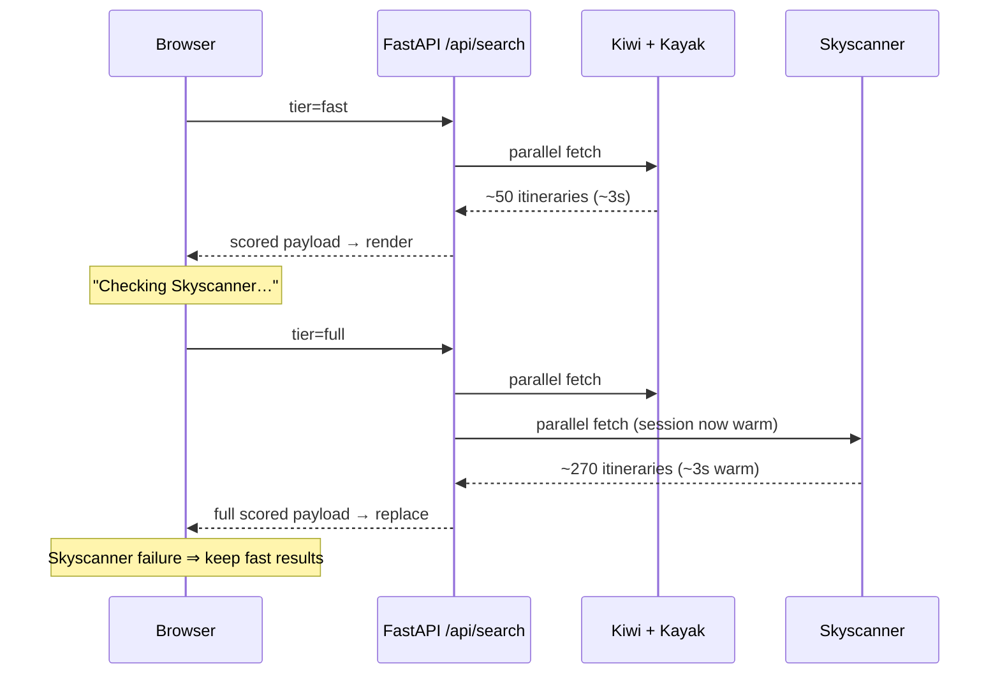

# Architecture & Deployment

Flight best-value search engine. Single FastAPI process serving a static
browser frontend, aggregating flight data from three RapidAPI providers,
with a background price-watcher that emails alerts.

## Deployment topology

## Two-phase search flow

`/api/search` accepts a `tier` query param. The frontend fires both in
sequence so first results paint fast, then get upgraded:

## Components

| Layer | File(s) | Role |
|-------|---------|------|
| Web / API | `app/main.py` | FastAPI routes, auth, validation handler, static mount |
| Search core | `app/search.py`, `app/scoring.py`, `app/filters.py` | fetch → filter → ValueScore → present; `fast` tier flag |
| Providers | `app/providers.py` + `*_client.py` / `*_transform.py` | `MultiProvider` runs Kiwi/Kayak/Skyscanner in parallel via RapidAPI, dedupes, per-provider PERF timing |
| Watcher | `app/watcher.py`, `app/notifier.py` | APScheduler interval jobs; SMTP price-drop alerts |
| Auth | `app/auth.py` | JWT, bcrypt passwords, TOTP MFA |
| Frontend | `static/app.js`, `static/index.html`, `static/airports.js` | search form, results, top-picks, charts, watches UI |
| State | `data/users.json`, `data/watches.json` | flat-file persistence (no DB) |

## Runtime facts

- **Process:** `uvicorn app.main:app --host 0.0.0.0 --port 8000`, managed by
  `systemd` unit `flight-search.service` (`Restart=always`, `RestartSec=3`).
- **Providers:** all three reached over RapidAPI (`*.p.rapidapi.com`) using
  an `x-rapidapi-key`. Pricing is always queried `adults=1` (per-person).
- **Schedules:** price watcher every 30 min, healthcheck every 10 min
  (APScheduler, in-process).
- **Persistence:** flat JSON files under `data/` — no external database.
- **Notifications:** SMTP (skipped silently if `SMTP_HOST` unset).
- **Observability:** structured logs in `logs/app.log` — `SEARCH start/done`,
  per-provider `PERF`, watcher ticks.
