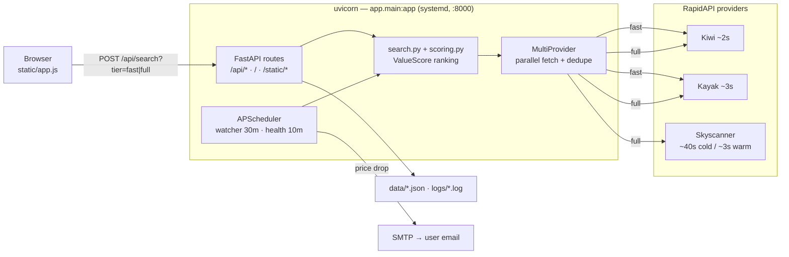

# Flight Optimization App

Local web app: search flights and rank by **best value** (low cost + fewest
stops/direct + shortest layovers). Real fares via **RapidAPI → Kiwi.com Cheap
Flights** (default; one API key, includes Wizz/LCCs + self-transfer). Also
supports Sky-Scrapper (RapidAPI), Kiwi Tequila, Amadeus, or offline mock.

Spec: `flight_agent_instructions.md` · Plan: `WORKPLAN.md`

## Features
- Web form: origin, destination, dates, travelers (adults), direct/connections, airline include/exclude **by name**
- Weighted scoring (best value = low cost + few stops/direct + short layovers):
  `0.50·norm_price + 0.30·norm_stops + 0.20·norm_layover` (lower = better)
- Three result buckets: **Top-3 Best Value**, **Cheapest**, **Fastest**
- Strict post-fetch filtering, input validation, 429 backoff, descriptive errors

## Setup
```bash
python3 -m venv .venv
source .venv/bin/activate
pip install -r requirements.txt
cp .env.example .env        # add your Amadeus key + secret
```

**Default `PROVIDER=rapidapi-kiwi`** (one key, real LCC fares):
1. Create a free account at https://rapidapi.com (sign in with Google/GitHub)
2. Subscribe (free Basic plan) to **Kiwi.com Cheap Flights**:
   https://rapidapi.com/.../kiwi-com-cheap-flights
3. Copy your **x-rapidapi-key** into `.env` as `RAPIDAPI_KEY=...`
   (host already set: `KIWI_RAPIDAPI_HOST=kiwi-com-cheap-flights.p.rapidapi.com`)

Other providers: `PROVIDER=kiwi` (Tequila direct, https://tequila.kiwi.com),
`PROVIDER=amadeus` (https://developers.amadeus.com — no LCCs), or
`PROVIDER=mock` (offline sample data, no key needed).

## Run
```bash
uvicorn app.main:app --reload
# open http://localhost:8000
```

## Test
```bash
pytest               # unit tests, offline fixtures, no live API calls
pytest -m e2e        # live web cross-check (needs KIWI_API_KEY; else skips)
pytest -m "not e2e"  # explicitly exclude live tests
```

### E2E web verification
`tests/e2e/test_tlv_clj_web_oracle.py` verifies the user scenario
**TLV→CLJ, 04/08/2026–11/08/2026** against live Kiwi data: app returns real
offers (incl. Wizz), its #1 best-value has the minimum score of all returned
options, its cheapest matches the web minimum price, and a multi-leg
self-transfer (the proposed via-OTP combo) does **not** win when a direct/low-stop
flight exists. Kiwi is the oracle because Skyscanner/Wizzair scraping is
bot-blocked, ToS-restricted, and flaky.

## Architecture

See [ARCHITECTURE.md](ARCHITECTURE.md) for the full deployment topology and the
two-phase search sequence. High-level view:



File layout:

```
app/
  config.py                  settings + weights + provider choice from .env
  models.py                  Pydantic request/response + internal Itinerary
  validation.py              IATA, future dates, dep<ret, include xor exclude
  airlines.py                airline name <-> IATA code mapping
  providers.py               provider factory -> Itineraries (source-agnostic)
  kiwi_rapidapi_client.py    RapidAPI Kiwi.com Cheap Flights (default) + backoff
  kiwi_rapidapi_transform.py RapidAPI-Kiwi JSON -> Itinerary
  rapidapi_client.py         RapidAPI Sky-Scrapper client
  rapidapi_transform.py      Sky-Scrapper JSON -> Itinerary
  kiwi_client.py             Kiwi Tequila direct + 429 backoff
  kiwi_transform.py          Tequila JSON -> Itinerary
  amadeus_client.py          OAuth2 token cache + flight-offers + 429 backoff
  transform.py               Amadeus JSON -> Itinerary
  mock_provider.py           offline sample data (no key)
  filters.py                 direct-only / include / exclude (per segment)
  scoring.py                 normalize + weighted score (price+stops+layover)
  output.py                  best-value/cheapest/fastest + all options + markdown
  search.py                  pipeline orchestration (provider-agnostic)
  main.py                    FastAPI routes + static mount
static/                      index.html, app.js (cost chart + full route list), style.css
static/              index.html, app.js, style.css
tests/               unit tests + fixture
```

## Notes
- Airline filters accept regular names (e.g. `Delta`, `Ryanair`) — mapped to IATA
  codes in `airlines.py`. Unknown names return a clear 422 error. 2-letter IATA
  codes also accepted directly.
- Amadeus `includedAirlineCodes` / `excludedAirlineCodes` are mutually exclusive;
  the app enforces "one or the other" and re-applies the filter per segment.
- Amadeus **test** environment has sparse data — some routes/dates return empty.
