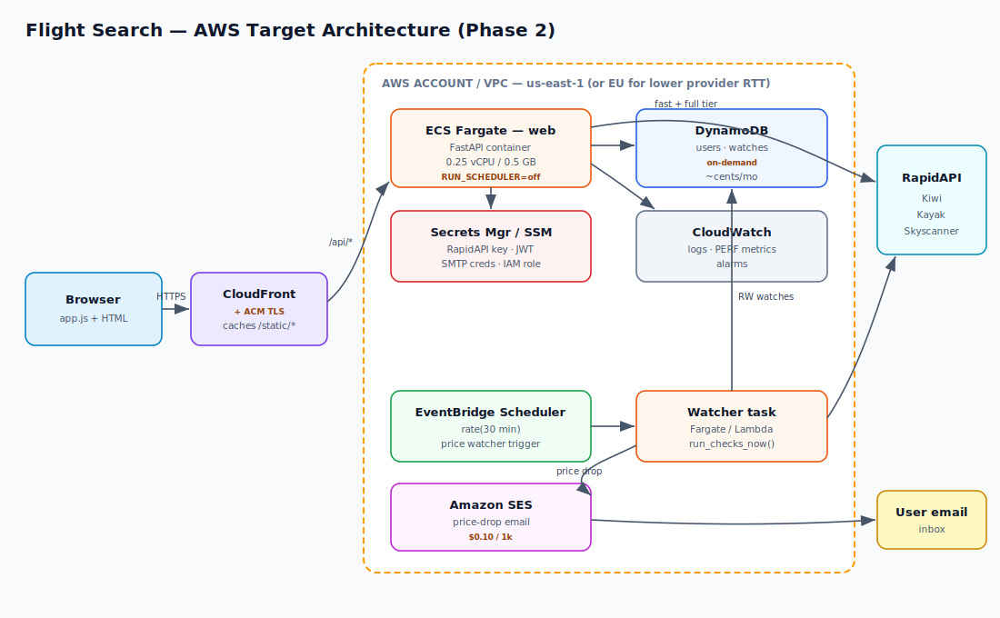
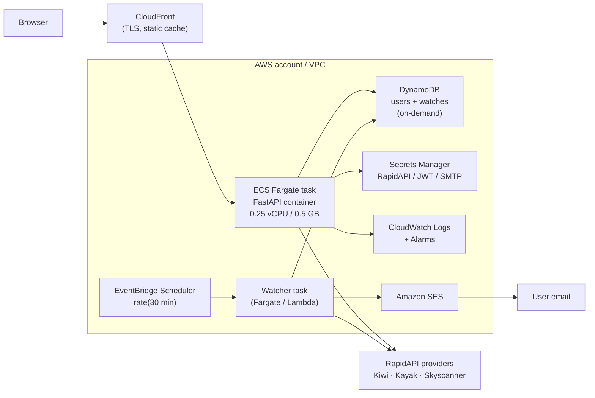

# AWS Migration Plan — Flight Search

How to move the Flight Search application from a single self-hosted
systemd/uvicorn host to AWS, with a focus on **cost-effectiveness** for a
low-traffic, personal-scale workload.

> All prices are **rough monthly estimates in `us-east-1`** for planning only.
> Verify against the AWS Pricing Calculator before committing.

---

## 1. Current state (what we are moving)

| Aspect | Today |
|--------|-------|
| Runtime | `uvicorn app.main:app` on port 8000, managed by `systemd` (`Restart=always`) |
| App type | FastAPI (async), serves JSON API **and** static frontend (`/static/*`, `/`) |
| State | Flat JSON files — `data/users.json`, `data/watches.json` |
| Scheduler | **In-process** APScheduler — price watcher every 30 min, healthcheck every 10 min |
| Email | SMTP (price-drop alerts) |
| Outbound deps | RapidAPI providers (Kiwi, Kayak, Skyscanner) over HTTPS |
| Secrets | RapidAPI key, JWT secret, SMTP creds (currently env/file) |
| Auth | JWT + bcrypt + TOTP MFA |
| Observability | `logs/app.log`, `logs/server.log` |

**Workload characteristics that drive the design:**

- **Very low traffic** (personal / few users) → favor *scale-to-low*, not scale-out.
- **Long upstream latency** — Skyscanner cold call ≈ **40 s**. This is critical:
  it **exceeds API Gateway's hard 29 s integration timeout**, so a naive
  Lambda + API Gateway port is fragile for the full-tier search.
- **Always-on scheduler** — the 30-min watcher wants a persistent runtime or a
  separate scheduled trigger.
- **Tiny state** — kilobytes of JSON; any managed store is effectively free at
  this scale.

---

## 2. Target options compared

| Option | What it is | Effort | Est. cost/mo | Fit |
|--------|-----------|--------|--------------|-----|
| **A. Lightsail instance** (recommended phase 1) | Lift-and-shift the systemd unit onto a small Graviton VPS | **Low** (hours) | **~$10** (2 GB) | Cheapest, no refactor, keeps APScheduler |
| **B. EC2 t4g.small + EBS** | Same as A but raw EC2 | Low | ~$12 on-demand, **~$7 w/ 1-yr Savings Plan** | Cheap, more knobs than Lightsail |
| **C. ECS Fargate (no ALB)** | Containerized task, public IP, TLS via CloudFront/own | Medium | ~$10–15 task + data | Scalable, no server to patch |
| **D. App Runner** | Fully managed container, HTTPS + autoscale built in | Medium | ~$25–45 (min 1 instance) | Easiest managed path, pricier idle |
| **E. Lambda + API Gateway** | Serverless via Mangum | High | **~$1–3** (near-zero idle) | Cheapest at idle **but** 29 s timeout breaks full-tier Skyscanner; scheduler must move to EventBridge |

The ALB-fronted Fargate pattern is deliberately excluded for the cost-effective
track: an **Application Load Balancer alone is ~$16+/mo**, which dwarfs the
compute for this workload.

---

## 3. Recommendation

**Phase 1 — Lift-and-shift (do this first): AWS Lightsail (Option A).**
Cheapest, lowest-risk, no code change. Keeps the in-process APScheduler and the
two-phase search exactly as-is. Get it running in the cloud in an afternoon.

**Phase 2 — Cloud-native target (when you want managed/scalable): containerize
to ECS Fargate (Option C)** with managed state and a decoupled scheduler. Pay a
little more for no-server-to-patch and clean scaling, while avoiding the ALB tax
by fronting with CloudFront (or a single public task for personal use).

**When to pick serverless (Option E):** only if traffic is rare/bursty and you
accept the refactor — and you must first make the full-tier search async (return
fast-tier immediately, deliver Skyscanner results via polling/WebSocket) to live
within the 29 s API Gateway limit.

---

## 4. Recommended target architecture (Phase 2)

Same diagram as Mermaid source

---

## 5. Component mapping (current → AWS)

| Current | Phase 1 (Lightsail) | Phase 2 (cloud-native) |
|---------|--------------------|------------------------|
| systemd + uvicorn | Same systemd unit on Lightsail instance | Container image on **ECS Fargate** |
| Static frontend | Served by app | **CloudFront** in front (cache `/static/*`), or keep app-served |
| `data/*.json` | Files on instance + **snapshot backups** | **DynamoDB** (on-demand) tables `users`, `watches` |
| In-process APScheduler | Keep as-is | **EventBridge Scheduler** → watcher task/Lambda (set `RUN_SCHEDULER=false` in web container) |
| SMTP email | Existing SMTP, or point at **SES SMTP endpoint** | **Amazon SES** (API or SMTP) |
| Secrets (env/file) | Instance env / SSM Parameter Store | **Secrets Manager** (or SSM Parameter Store — cheaper) |
| TLS | Caddy/Nginx + Let's Encrypt on instance | **CloudFront/ACM** (managed cert) |
| Logs | `logs/*.log` | **CloudWatch Logs** (`awslogs` driver) |
| Region | — | Pick close to users *and* providers; `eu-central-1`/`eu-west-1` may cut RapidAPI RTT vs `us-east-1` |

---

## 6. Migration mechanics

### 6.1 Data
- State is tiny JSON. For Phase 2, add a thin storage adapter so `auth.py` /
  `watcher.py` read/write through one interface (file ↔ DynamoDB). A one-off
  script loads existing `users.json` / `watches.json` into DynamoDB.
- DynamoDB on-demand at this volume ≈ **cents/month**. No capacity planning.
- Phase 1 keeps files; protect with daily instance/EBS snapshots.

### 6.2 Secrets
- Move RapidAPI key, JWT signing secret, SMTP creds out of files into
  **SSM Parameter Store (SecureString)** — effectively free — or Secrets Manager
  (~$0.40/secret/mo, adds rotation).
- App reads them at boot via IAM role (no static AWS keys on the box).

### 6.3 Scheduler decoupling (Phase 2)
- Gate the in-process scheduler behind an env flag (e.g. `RUN_SCHEDULER`).
  Web container runs with it **off**; a dedicated invocation runs the checks.
- **EventBridge Scheduler** `rate(30 minutes)` triggers either a small Fargate
  task or a Lambda that calls the existing `run_checks_now()` path.
- Healthcheck → CloudWatch alarm on the service instead of a 10-min job.

### 6.4 Email
- **Amazon SES**: verify sender domain/identity, request production access
  (out of sandbox). Either keep `smtplib` and point at the SES SMTP endpoint
  (smallest code change) or switch to the SES API.
- Cost: **$0.10 per 1,000 emails** — negligible.

### 6.5 The 40 s Skyscanner constraint
- On a persistent runtime (Lightsail / EC2 / Fargate) there is **no gateway
  timeout** — the 40 s cold call is fine, exactly as today.
- If you ever go serverless: keep the two-phase split, return the **fast tier**
  synchronously, and deliver the full/Skyscanner tier via an async channel
  (client polls a job id, or WebSocket) to stay under API Gateway's 29 s cap.

---

## 7. Security
- **IAM role per workload** (least privilege): web task → read secrets + RW its
  DynamoDB tables; watcher → RW watches + `ses:SendEmail`.
- No long-lived AWS keys on instances; use instance/task roles.
- Secrets in Parameter Store/Secrets Manager, never in the image or git.
- TLS everywhere (CloudFront/ACM or Caddy on the instance).
- Security group: inbound 443 only (and 80→443 redirect); SSH restricted to your
  IP or via SSM Session Manager (no open 22).
- Keep JWT/MFA as-is; rotate the JWT secret during cutover.

## 8. Observability
- Ship logs to **CloudWatch Logs**; keep the structured `SEARCH` / `PERF` lines —
  they map cleanly to **Metric Filters** (e.g. provider latency, search duration).
- Alarms: app 5xx rate, watcher failures, provider error spikes, instance health.
- Optional dashboard: per-provider PERF latency (we already log it).

## 9. CI/CD & IaC
- **IaC:** Terraform or AWS CDK. Start with Lightsail/EC2 + Parameter Store;
  extend to ECS/DynamoDB/SES for Phase 2. Keep state in an S3 backend.
- **CI:** GitHub Actions → build image → push to **ECR** → update Fargate
  service (or rsync + `systemctl restart` for the Lightsail phase).
- **Containerize** for Phase 2: small `python:3.12-slim` (or Graviton/arm64)
  image, `uvicorn` entrypoint, non-root user.

---

## 10. Cost summary

| Scenario | Components | Est. total/mo |
|----------|-----------|---------------|
| **Phase 1 — Lightsail** | 2 GB Graviton instance + snapshots | **~$10** |
| **Phase 2 — Fargate (no ALB)** | 0.25 vCPU task + DynamoDB + SES + CloudFront (low traffic) + logs | **~$15–20** |
| **App Runner** | min 1 instance + DynamoDB + SES | ~$30–45 |
| **Serverless (after async refactor)** | Lambda + HTTP API + DynamoDB + SES + EventBridge | **~$1–5** |

**Bottom line:** for a personal, low-traffic app the cheapest *practical* path is
**Lightsail (~$10/mo)** now, graduating to **Fargate (~$15–20/mo)** if/when you
want a managed, no-patch, scalable setup. True serverless is cheapest at idle but
only worth it after splitting the slow Skyscanner tier to an async flow.

---

## 11. Step-by-step (Phase 1, the quick win)

1. Create a Lightsail Graviton (arm64) instance, 2 GB, Ubuntu LTS.
2. Install Python 3.12 + the venv; clone the repo; `pip install -r requirements`.
3. Put secrets in **SSM Parameter Store**; have the app read them on boot.
4. Copy the systemd unit (`flight-search.service`); `systemctl enable --now`.
5. Front with Caddy (auto Let's Encrypt TLS) → reverse-proxy to `127.0.0.1:8000`.
6. Open security group 80/443 only; SSH via your IP or SSM.
7. Migrate `data/*.json` to the instance; enable daily snapshots.
8. Verify: health endpoint, a live search (both tiers), the watcher tick, a test
   alert email.
9. Point DNS at the instance; decommission the old host after a soak period.

**Rollback:** the old host stays running until the soak passes; DNS flip back is
instant. Phase 1 changes no application code, so risk is minimal.
